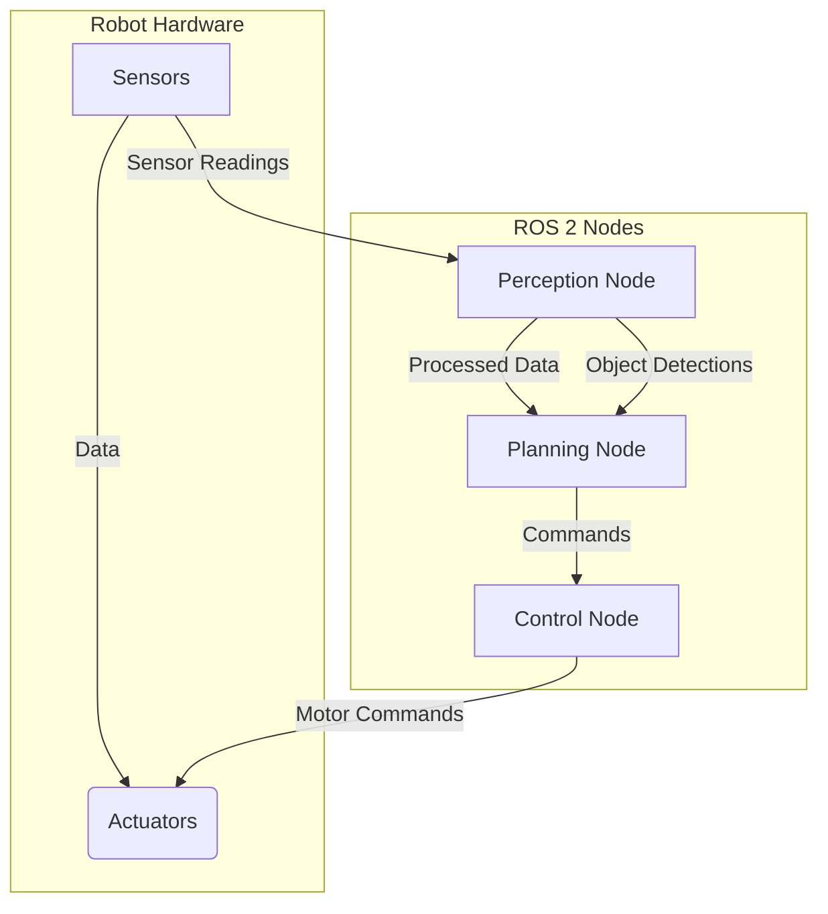

# Introduction to ROS 2 Middleware for Robot Control

## What is ROS 2?

ROS 2 (Robot Operating System 2) is a flexible framework for writing robot software. It's not an operating system in the traditional sense, but rather a set of software libraries, tools, and conventions that aim to simplify the task of creating complex and robust robot applications. ROS 2 provides a standardized way for different software components (called "nodes") to communicate and cooperate.

Developed as a successor to the original ROS (ROS 1), ROS 2 was redesigned to address the needs of modern robotics, including real-time control, multi-robot systems, and embedded platforms. It emphasizes security, quality of service (QoS), and support for various middleware implementations.

## Why ROS 2 for AI-Native Robotics?

In the context of AI-native robotics, where robots are designed to learn, adapt, and make autonomous decisions, ROS 2 plays a crucial role as the foundational middleware.

-   **Modular Architecture**: ROS 2 promotes a modular design, allowing AI components (e.g., perception, planning, learning agents) to run as independent nodes and communicate seamlessly with traditional robot control systems (e.g., motor drivers, sensor interfaces).
-   **Inter-process Communication**: It provides efficient mechanisms for various AI algorithms (e.g., deep learning models for object recognition, reinforcement learning agents) to exchange data (sensor readings, commands, processed information) with the robot's actuators and other software modules.
-   **Tools and Ecosystem**: ROS 2 comes with a rich set of tools for debugging, visualization (e.g., RViz), and data logging, which are invaluable for developing and testing complex AI behaviors in robots.
-   **Scalability**: Its distributed nature supports deploying AI components across multiple compute units, from embedded systems on the robot to powerful cloud servers, enabling more sophisticated AI capabilities.
-   **Community and Standards**: A large and active community contributes to ROS 2, ensuring continuous development, a wide range of packages, and adherence to emerging robotics standards.

## ROS 2 Architecture Overview

The core of ROS 2's architecture revolves around the concept of a "graph" where independent executable programs, or **nodes**, communicate with each other using various mechanisms.

**Key components in the ROS 2 graph include:**

For a deeper dive into these components, see [Chapter 2: ROS 2 Nodes, Topics, and Services Deep-Dive](02-nodes-topics-services.md).

-   **Nodes**: Individual executable programs that perform specific tasks. For example, a "camera_node" might capture images, a "navigation_node" might plan paths, and an "AI_agent_node" might process sensor data to make decisions.
-   **Topics**: A mechanism for nodes to exchange data asynchronously using a publisher-subscriber model. Nodes publish messages to topics, and other nodes subscribe to those topics to receive the messages.
-   **Services**: A synchronous communication mechanism where a client node sends a request to a server node, and the server node processes the request and sends back a response. Useful for operations that require immediate feedback.
-   **Actions**: A higher-level, asynchronous communication mechanism built on topics and services, designed for long-running tasks. A client sends a goal, receives continuous feedback, and eventually a result.
-   **Parameters**: Configuration values that can be set and retrieved by nodes at runtime.
-   **Middleware**: ROS 2 is middleware agnostic, meaning it can use different underlying communication protocols (like DDS - Data Distribution Service) for its transport layer. This allows for flexibility and optimization for various use cases.

## Installation Guide

For detailed installation instructions, please refer to the [official ROS 2 documentation](https://docs.ros.org/en/humble/Installation.html). It is highly recommended to follow their specific instructions for your operating system (Ubuntu Linux is typically preferred for ROS 2 development, but Windows and macOS are also supported).

## Summary

ROS 2 provides a robust and flexible framework essential for building modern AI-native robotic systems. Its modularity, efficient communication mechanisms, rich toolset, and strong community support make it an indispensable middleware for integrating complex AI algorithms with robotic hardware. Understanding its core architectural components—nodes, topics, services, and actions—is fundamental to developing advanced robotic applications.

## Further Reading

-   [ROS 2 Documentation](https://docs.ros.org/en/humble/index.html)
-   [ROS 2 Concepts](https://docs.ros.org/en/humble/Concepts.html)
-   [The ROS 2 Technical Steering Committee (TSC)](https://ros.org/reps/rep-2000.html)
