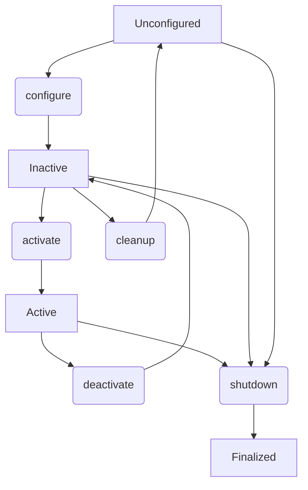
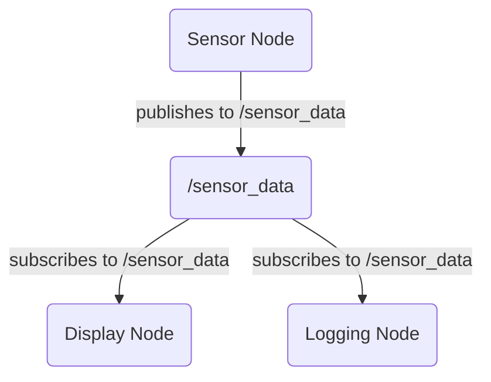
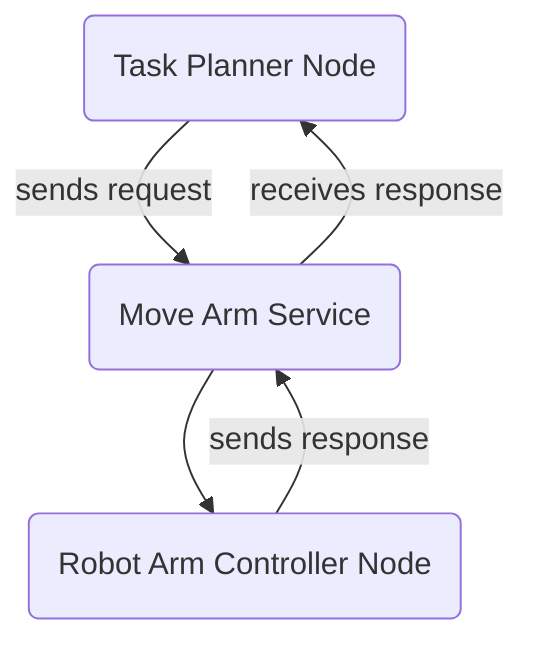

# ROS 2 Nodes, Topics, and Services Deep-Dive

In ROS 2, applications are built as a collection of independent, interconnected processes called **nodes**. These nodes communicate with each other using various mechanisms, primarily **topics** for asynchronous data streaming and **services** for synchronous request/response interactions. Understanding these core communication patterns is fundamental to developing effective ROS 2 applications, especially when integrating with Python-based AI agents, as we'll explore in [Chapter 3: Bridging Python Agents to ROS Controllers using rclpy](03-python-rclpy-integration.md).

## 2.1. Nodes: The Building Blocks of ROS 2

A ROS 2 node is an executable program that performs a specific task. Think of a node as a module or a component within your robot's software system. For example, you might have:
-   A camera node to capture images.
-   A lidar node to process laser scan data.
-   A navigation node to plan paths.
-   A motor control node to command robot movement.
-   An AI inference node to detect objects or make decisions.

**Key characteristics of ROS 2 nodes:**
-   **Modularity**: Each node is responsible for a single, well-defined task, making the system easier to develop, debug, and maintain.
-   **Reusability**: Nodes can be reused across different robot platforms or applications.
-   **Isolation**: Nodes run as separate processes, providing fault tolerance. If one node crashes, it ideally shouldn't bring down the entire robot system.

### Node Lifecycle

ROS 2 introduces a managed lifecycle for nodes, allowing for more robust and predictable behavior, especially in critical applications. A managed node transitions through various states:

-   **Unconfigured**: The initial state. The node exists but is not yet ready to do work.
-   **Inactive**: The node has been configured and is ready to activate.
-   **Active**: The node is fully operational and performing its task (e.g., publishing data, providing services).
-   **Finalized**: The node is being shut down.

Transitions between these states (e.g., `configure`, `activate`, `deactivate`, `cleanup`, `shutdown`) allow for controlled startup, graceful shutdown, and error recovery.

## 2.2. Topics: Asynchronous Data Streaming

Topics are the most common way for nodes to exchange data in ROS 2. They implement a **publisher-subscriber** (pub/sub) model, where:
-   **Publishers** send messages (data packets) to a named topic.
-   **Subscribers** listen to a named topic to receive messages.

Messages are typed, meaning they have a predefined structure (e.g., `sensor_msgs/msg/Image` for camera images, `std_msgs/msg/String` for simple text). ROS 2's underlying middleware (DDS by default) handles the routing of messages between publishers and subscribers.

**Characteristics of Topics:**
-   **One-to-many communication**: A single publisher can send messages to multiple subscribers, and a single subscriber can receive messages from multiple publishers on the same topic.
-   **Asynchronous**: Publishers don't wait for subscribers to receive messages. Messages are broadcast, and subscribers receive them when they are ready.
-   **Decoupled**: Publishers and subscribers don't need to know about each other's existence directly, only the topic name and message type.

### Example: Simple Publisher and Subscriber Interaction

Consider a robot with a sensor and a display. A sensor node might publish data to a topic `/sensor_data`, and a display node subscribes to `/sensor_data` to visualize it.

### Quality of Service (QoS) Policies

QoS settings allow you to configure how messages are exchanged over topics, providing fine-grained control over reliability, latency, and data persistence. Important QoS policies include:

-   **History**: How many samples or how much time to keep for transient local publishers.
    -   `KEEP_LAST`: Keep only the last `N` samples.
    -   `KEEP_ALL`: Keep all samples.
-   **Depth**: The number of samples to store when `KEEP_LAST` history policy is used.
-   **Reliability**: Guarantees about message delivery.
    -   `RELIABLE`: Guarantees message delivery (retries if necessary). Slower but safer.
    -   `BEST_EFFORT`: Attempts delivery but doesn't guarantee it. Faster but can lose messages.
-   **Durability**: Controls whether messages are persistent or volatile.
    -   `TRANSIENT_LOCAL`: New subscribers can receive historical messages.
    -   `VOLATILE`: Only live messages are sent to new subscribers.
-   **Liveliness**: How ROS 2 detects if a publisher/subscriber is still active.

Choosing the right QoS profile is crucial for different types of data (e.g., sensor data might use `BEST_EFFORT` for low latency, while critical command messages might use `RELIABLE`).

## 2.3. Services: Synchronous Request/Response

Services provide a way for nodes to implement a **synchronous request/response** communication pattern. This is useful for tasks where a client needs an immediate response from a server, such as:
-   Triggering an action on the robot (e.g., "take a picture").
-   Querying for specific information (e.g., "what is the current battery level?").
-   Performing a computation that returns a result.

A service definition includes both a **request** message type and a **response** message type.

### Example: Simple Service Client and Server

Imagine a "robot_arm_controller" node that provides a service to move the robot arm to a specific position. A "task_planner" node could be a client that requests this service.

**Characteristics of Services:**
-   **One-to-one communication**: A client sends a request to a server, and the server sends a response back to that client.
-   **Synchronous**: The client typically blocks (waits) until it receives a response from the server.
-   **Guaranteed delivery**: Services are generally reliable, ensuring that requests and responses are delivered.

## Summary

Nodes are the fundamental execution units in ROS 2. They communicate predominantly through topics for asynchronous, one-to-many data streaming, and services for synchronous, one-to-one request/response interactions. Understanding the characteristics of each, along with concepts like node lifecycles and QoS policies, is essential for designing and implementing robust, distributed robot applications in ROS 2.

## Further Reading

-   [ROS 2 Core Concepts: Nodes](https://docs.ros.org/en/humble/Concepts/Basic-Concepts.html#nodes)
-   [ROS 2 Core Concepts: Topics](https://docs.ros.org/en/humble/Concepts/Basic-Concepts.html#topics)
-   [ROS 2 Core Concepts: Services](https://docs.ros.org/en/humble/Concepts/Basic-Concepts.html#services)
-   [ROS 2 Quality of Service Policies](https://docs.ros.org/en/humble/Concepts/About-Quality-of-Service-Settings.html)
