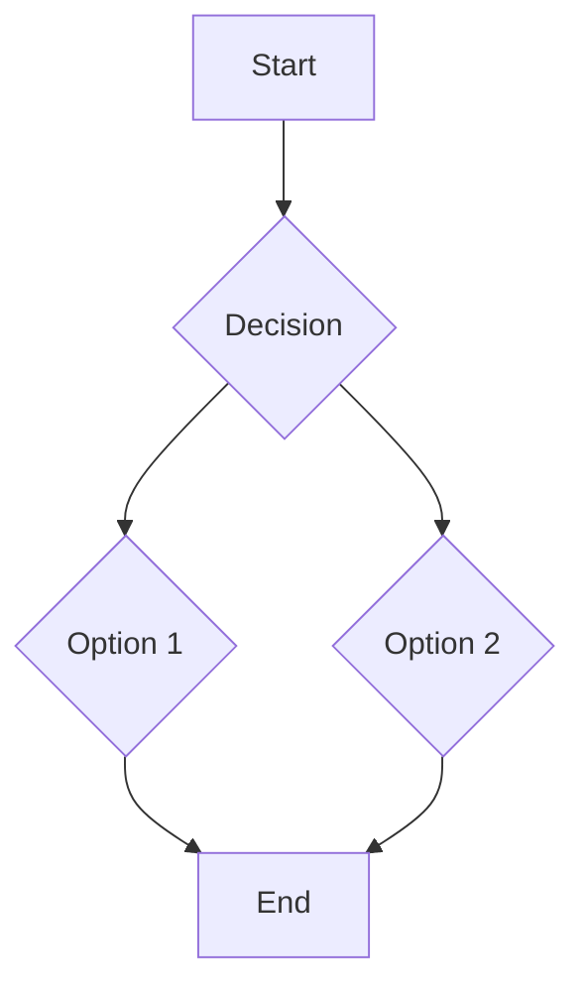

# [CHAPTER_TITLE]

## Introduction

[Chapter introduction goes here. Explain what the chapter will cover and its importance.]

## Core Concepts

[Detailed explanation of core concepts. Use headings, subheadings, lists, and tables for clarity.]

### Subsection 1.1

[Content for subsection.]

## Code Examples

[Include Python ROS 2 code examples here. Use Docusaurus code blocks with syntax highlighting.]

```python
# Example ROS 2 Python code
import rclpy
from rclpy.node import Node
from std_msgs.msg import String

class MinimalPublisher(Node):
    def __init__(self):
        super().__init__('minimal_publisher')
        self.publisher_ = self.create_publisher(String, 'topic', 10)
        timer_period = 0.5  # seconds
        self.timer = self.create_timer(timer_period, self.timer_callback)
        self.i = 0

    def timer_callback(self):
        msg = String()
        msg.data = 'Hello World: %d' % self.i
        self.publisher_.publish(msg)
        self.get_logger().info('Publishing: "%s"' % msg.data)
        self.i += 1

def main(args=None):
    rclpy.init(args=args)
    minimal_publisher = MinimalPublisher()
    rclpy.spin(minimal_publisher)
    minimal_publisher.destroy_node()
    rclpy.shutdown()

if __name__ == '__main__':
    main()
```

## Diagrams

[Embed Mermaid or other diagrams here.]



## Best Practices and Common Pitfalls

[Discuss best practices related to the chapter's topics and common issues to avoid.]

## Summary

[A brief summary of the key takeaways from the chapter.]

## Further Reading

[Links to external resources, official documentation, or related topics.]
